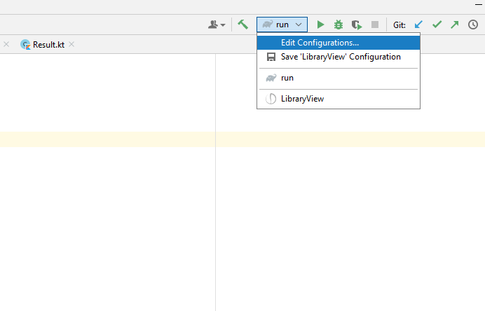
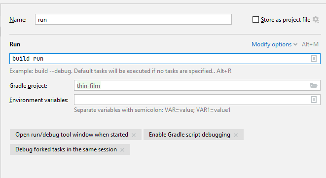

# Тонкие плёнки

## Как запустить dev-версию:

## Как пользоваться

Кнопкой **Append Layer** можно добавить новый слой в таблицу. В таблице 
параметры каждого слоя редактируются нажатием на параметр. Для начала расчёта нужно минимум три слоя, причём 
верхний принимается за среду (ambient), а нижний за подложку (substrate). Для добавления материалов
нужно открыть меню библиотеки сверху (либо нажать Ctrl+L), где из предложенных материалов и диапазонов выбрать нужный
Вам. После нажатия кнопки **Add** материал будет доступен для выбора в параметрах слоёв в таблице.
Кнопка **Tail Layer** удаляет последний слой. Также сверху задаются нижняя и верхняя границы длин волн для расчёта.