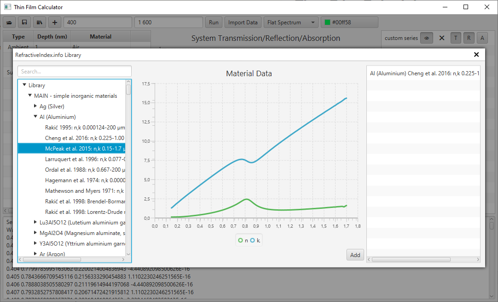

# Thin-Film Calculator

## Features

- calculates transition and reflection spectrums for the specified layers stack using 
<a href="https://en.wikipedia.org/wiki/Transfer-matrix_method_(optics)">TMM</a>
- beautiful User Interface baked with TornadoFX
- calculates reflection spectrum visible color according to CIE 1965 color curves approximation[1]
- integration with <a href="https://refractiveindex.info">RefractiveIndex.info</a> database - you can observe and use data directly from 
the database
- simple persistence - save all the experiment data in JSON-based _.exp_ format
- you can load spectrum measurements results directly to the in-app graph to compare it with the
theoretical calculations or fit it somehow.

## Building and Running

To build a jar use:

`gradle assemble`

To run the application:

`gradle run`

Note that all the commands have to be executed in project's root directory.

## Screenshots

## License
For the source code see LICENSE file.

Binaries are publicly available on "as is" basis without any restrictions.

## References
1. Chris Wyman, Peter-Pike Sloan, and Peter Shirley, Simple Analytic Approximations
   to the CIE XYZ Color Matching Functions, Journal of Computer Graphics Techniques (JCGT), vol. 2, no. 2, 1-11, 2013
   Available online http://jcgt.org/published/0002/02/01/
